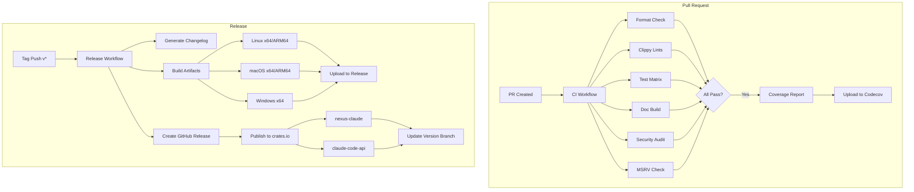

# CI/CD Pipeline

This document describes the continuous integration and deployment pipeline for Nexus.

## Overview



## Workflows

### CI Workflow (`ci.yml`)

Runs on every push and pull request to `main` and version branches.

#### Jobs

| Job | Description | Runs On |
|-----|-------------|---------|
| `fmt` | Check code formatting with rustfmt | ubuntu-latest |
| `clippy` | Run Clippy lints with `-D warnings` | ubuntu-latest |
| `test` | Run test matrix | ubuntu, macos, windows |
| `coverage` | Generate code coverage report | ubuntu-latest |
| `docs` | Build documentation | ubuntu-latest |
| `security` | Run cargo-deny audit | ubuntu-latest |
| `msrv` | Verify MSRV (1.88) | ubuntu-latest |

#### Test Matrix

```yaml
strategy:
  matrix:
    os: [ubuntu-latest, macos-latest, windows-latest]
    toolchain: [stable, beta]
    include:
      - os: ubuntu-latest
        toolchain: nightly
```

### Release Workflow (`release.yml`)

Triggered when a version tag (`v*`) is pushed.

#### Steps

1. **Create Release** - Generate changelog and create GitHub release
2. **Build Artifacts** - Build optimized binaries for all platforms
3. **Publish Crates** - Publish to crates.io in dependency order
4. **Update Branch** - Update the version branch (e.g., `v0.5`)

#### Artifacts

| Target | OS | Arch | Format |
|--------|-----|------|--------|
| `x86_64-unknown-linux-gnu` | Linux | x64 | tar.gz |
| `aarch64-unknown-linux-gnu` | Linux | ARM64 | tar.gz |
| `x86_64-apple-darwin` | macOS | x64 | tar.gz |
| `aarch64-apple-darwin` | macOS | ARM64 | tar.gz |
| `x86_64-pc-windows-msvc` | Windows | x64 | zip |

## GitHub Actions

### Composite Actions

#### `setup-rust`

Reusable action for Rust toolchain setup with caching.

```yaml
- uses: ./.github/actions/setup-rust
  with:
    toolchain: stable
    components: clippy, rustfmt
    targets: aarch64-unknown-linux-gnu
```

## Secrets Required

| Secret | Description | Used In |
|--------|-------------|---------|
| `CARGO_REGISTRY_TOKEN` | crates.io API token | release.yml |
| `CODECOV_TOKEN` | Codecov upload token | ci.yml |

## Branch Protection

### `main` Branch

- Require pull request before merging
- Require status checks to pass:
  - `fmt`
  - `clippy`
  - `test`
  - `docs`
  - `msrv`
- Require linear history (squash merge)

### `v*` Version Branches

- Require status checks to pass
- Allow direct push for hotfixes

## Quality Gates

### Required Checks

1. **Format** - Code must be formatted with rustfmt
2. **Lints** - No Clippy warnings
3. **Tests** - All tests pass on all platforms
4. **MSRV** - Builds with Rust 1.88

### Advisory Checks

1. **Coverage** - Report uploaded to Codecov (informational)
2. **Security** - cargo-deny audit (advisory only)

## Local Development

### Running CI Checks Locally

```bash
# Format
cargo fmt --all -- --check

# Clippy
cargo clippy --all-targets --all-features -- -D warnings

# Tests
cargo test --all-features

# Doc tests
cargo test --doc --all-features

# Documentation
cargo doc --all-features --no-deps

# Security audit
cargo deny check
```

### Pre-commit Hook

Consider adding a pre-commit hook:

```bash
#!/bin/sh
cargo fmt --all -- --check
cargo clippy --all-targets --all-features -- -D warnings
cargo test --all-features
```

## Troubleshooting

### CI Failures

| Issue | Solution |
|-------|----------|
| Format check fails | Run `cargo fmt --all` locally |
| Clippy warnings | Fix warnings or add `#[allow(...)]` with justification |
| Test failures | Check test output, run locally with `--nocapture` |
| MSRV failure | Check for features requiring newer Rust |

### Release Failures

| Issue | Solution |
|-------|----------|
| crates.io publish fails | Check token validity, version conflicts |
| Cross-compilation fails | Check target toolchain availability |
| Changelog generation fails | Verify conventional commit format |
